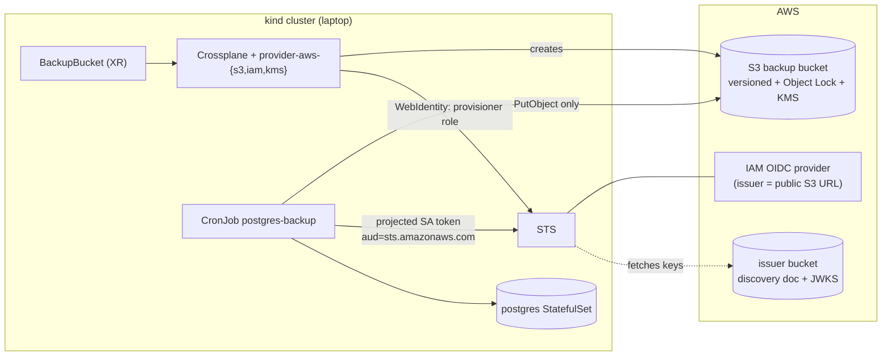

# Use case: back up the messages database to AWS S3, provisioned by Crossplane

A design write-up, not an implemented feature. Nothing here is applied to the cluster yet; the YAML
is a proposal to review before any of it lands under `k8s/`. See [Status of the claims in this
document](#status-of-the-claims-in-this-document) for what was checked against upstream docs and
what still has to be verified against the versions you install.

## Goal

A Kubernetes `CronJob` in the kind cluster takes a `pg_dump` of `messagedb` (the `messages` and
`authors` tables plus `alembic_version`) and writes it to an S3 bucket in AWS. Crossplane creates and
owns the AWS side (bucket, encryption key, IAM role) so the storage is declared in Git and reconciled
like everything else Argo CD syncs.

Non-goals: point-in-time recovery (that needs WAL archiving, not `pg_dump`), backing up Hazelcast (it
is a cache), and running Crossplane against anything except AWS.

## The one hard problem: kind has no AWS identity

On EKS a pod gets AWS credentials through IRSA or Pod Identity. A kind cluster has neither, so the
Job cannot simply "write to S3". The options:

| Option | How the pod authenticates | Verdict |
|---|---|---|
| Static IAM user access keys in a Secret | Long-lived key, injected via `op run` like the other secrets | Simplest, and the weakest: it never expires, it is readable by anyone who can `get secret`, and it leaks into `kubectl get -o yaml` and Argo diffs. Fine for a throwaway spike only. |
| IAM Roles Anywhere | X.509 client cert (cert-manager private CA) exchanged for short-lived credentials | Works from any cluster, but adds a CA, a trust anchor and the `aws_signing_helper` to the image. |
| **OIDC federation to the kind API server** | Projected ServiceAccount token, audience `sts.amazonaws.com`, exchanged with `sts:AssumeRoleWithWebIdentity` | **Recommended.** Short-lived credentials, no secrets in the cluster, and the trust policy pins the exact ServiceAccount. Costs a one-time bootstrap and a re-publish per cluster (below). |

The rest of this document assumes OIDC federation. It is the same mechanism IRSA uses; you are just
hosting the issuer yourself.

## Architecture



Two separate AWS identities, on purpose:

- **Provisioner role** (used by Crossplane's providers): can create the bucket, key and writer role,
  and nothing outside a name prefix. This is the powerful one.
- **Writer role** (used by the Job): `PutObject` on one prefix and `GenerateDataKey` on one key.
  It cannot read, list or delete. A compromised backup pod can add backups; it cannot read or destroy
  them.

## Part 1: the trust anchor (created once, outside Crossplane)

Crossplane cannot bootstrap its own credentials, so these live outside it (Terraform, or the AWS CLI
as below). They are the only long-lived things and contain no secrets.

**1. Issuer bucket.** STS validates tokens by fetching the issuer's discovery document and JWKS over
HTTPS, so both must be publicly readable at the issuer URL. They hold public keys only.

```bash
ISSUER_BUCKET=fastapi-o2-oidc-<account-id>-eu-west-1   # placeholder, globally unique
REGION=eu-west-1
aws s3api create-bucket --bucket "$ISSUER_BUCKET" --region "$REGION" \
  --create-bucket-configuration LocationConstraint="$REGION"
# Allow a bucket policy that grants public read of exactly two objects; keep everything else blocked.
aws s3api put-public-access-block --bucket "$ISSUER_BUCKET" --public-access-block-configuration \
  BlockPublicAcls=true,IgnorePublicAcls=true,BlockPublicPolicy=false,RestrictPublicBuckets=false
aws s3api put-bucket-policy --bucket "$ISSUER_BUCKET" --policy '{
  "Version":"2012-10-17","Statement":[{"Effect":"Allow","Principal":"*","Action":"s3:GetObject",
  "Resource":["arn:aws:s3:::'"$ISSUER_BUCKET"'/.well-known/openid-configuration",
              "arn:aws:s3:::'"$ISSUER_BUCKET"'/keys.json"]}]}'
```

**2. Kind API server as the issuer.** In `k8s/kind-config.yaml`, on the control-plane node:

```yaml
kubeadmConfigPatches:
  - |
    kind: ClusterConfiguration
    apiServer:
      extraArgs:
        service-account-issuer: https://<ISSUER_BUCKET>.s3.<REGION>.amazonaws.com
        service-account-jwks-uri: https://<ISSUER_BUCKET>.s3.<REGION>.amazonaws.com/keys.json
```

**3. Publish the discovery document and keys** (the cluster serves both itself):

```bash
kubectl get --raw /.well-known/openid-configuration > discovery.json
kubectl get --raw /openid/v1/jwks > keys.json
aws s3 cp discovery.json "s3://$ISSUER_BUCKET/.well-known/openid-configuration" --content-type application/json
aws s3 cp keys.json      "s3://$ISSUER_BUCKET/keys.json"                        --content-type application/json
```

**4. IAM OIDC identity provider** for that URL, with client id `sts.amazonaws.com`:

```bash
aws iam create-open-id-connect-provider \
  --url "https://$ISSUER_BUCKET.s3.$REGION.amazonaws.com" --client-id-list sts.amazonaws.com
```

**5. Provisioner role and permissions boundary** (trust and policy in
[Security requirements](#security-requirements)).

> **This project recreates its kind cluster.** A new cluster has a new ServiceAccount signing key, so
> the JWKS in step 3 goes stale and every `AssumeRoleWithWebIdentity` fails with `InvalidIdentityToken`.
> Either re-run step 3 from `deploy-kind.sh` after `kind create cluster` (needs AWS credentials on the
> host, e.g. through the same `op run`), or pin the signing key: keep `sa.key`/`sa.pub` in 1Password
> and mount them into the control-plane node via `extraMounts` at `/etc/kubernetes/pki/` so kubeadm
> reuses them and the published JWKS stays valid across recreations.

## Part 2: Crossplane install and provider auth

Installed by `deploy-kind.sh` (pinned Helm chart, like Kyverno) into `crossplane-system`, then these
package objects:

```yaml
# k8s/crossplane/bootstrap/providers.yaml
apiVersion: pkg.crossplane.io/v1
kind: Provider
metadata: {name: provider-aws-s3}
spec:
  package: xpkg.crossplane.io/upbound/provider-aws-s3:<pin>
  runtimeConfigRef: {name: aws-oidc}
---
apiVersion: pkg.crossplane.io/v1
kind: Provider
metadata: {name: provider-aws-iam}
spec:
  package: xpkg.crossplane.io/upbound/provider-aws-iam:<pin>
  runtimeConfigRef: {name: aws-oidc}
---
apiVersion: pkg.crossplane.io/v1
kind: Provider
metadata: {name: provider-aws-kms}
spec:
  package: xpkg.crossplane.io/upbound/provider-aws-kms:<pin>
  runtimeConfigRef: {name: aws-oidc}
---
apiVersion: pkg.crossplane.io/v1
kind: Function
metadata: {name: function-go-templating}
spec:
  package: xpkg.crossplane.io/crossplane-contrib/function-go-templating:<pin>
---
apiVersion: pkg.crossplane.io/v1
kind: Function
metadata: {name: function-auto-ready}
spec:
  package: xpkg.crossplane.io/crossplane-contrib/function-auto-ready:<pin>
```

The provider pods get a projected token, so the provisioner role is assumed with no stored key:

```yaml
# k8s/crossplane/bootstrap/runtime-config.yaml
apiVersion: pkg.crossplane.io/v1beta1
kind: DeploymentRuntimeConfig
metadata: {name: aws-oidc}
spec:
  deploymentTemplate:
    spec:
      selector: {}
      template:
        spec:
          containers:
            - name: package-runtime
              volumeMounts:
                - {name: aws-token, mountPath: /var/run/secrets/aws, readOnly: true}
          volumes:
            - name: aws-token
              projected:
                sources:
                  - serviceAccountToken: {audience: sts.amazonaws.com, expirationSeconds: 3600, path: token}
---
apiVersion: aws.m.upbound.io/v1beta1        # namespaced resources; see "Status of the claims"
kind: ClusterProviderConfig
metadata: {name: aws-oidc}
spec:
  credentials:
    source: WebIdentity
    webIdentity:
      roleARN: arn:aws:iam::<account-id>:role/fastapi-o2-crossplane-provisioner
      tokenConfig:
        source: Filesystem
        fs: {path: /var/run/secrets/aws/token}
```

## Part 3: the Crossplane API for the bucket

One composite resource, `BackupBucket`, hides the ten AWS objects behind a few fields. The team that
runs the app only writes the XR; the Composition is the platform's decision about what "a safe backup
bucket" means.

### XRD

```yaml
# k8s/crossplane/platform/xrd.yaml
apiVersion: apiextensions.crossplane.io/v2
kind: CompositeResourceDefinition
metadata: {name: backupbuckets.storage.fastapi-o2.local}
spec:
  scope: Namespaced
  group: storage.fastapi-o2.local
  names: {kind: BackupBucket, plural: backupbuckets}
  versions:
    - name: v1alpha1
      served: true
      referenceable: true
      schema:
        openAPIV3Schema:
          type: object
          properties:
            spec:
              type: object
              required: [region, bucketName, oidcIssuer, oidcProviderArn, writer]
              properties:
                region: {type: string}
                bucketName: {type: string, description: "Globally unique, e.g. fastapi-o2-backups-<account>-<region>"}
                prefix: {type: string, default: "messages/"}
                retentionDays: {type: integer, default: 30}
                objectLockDays: {type: integer, default: 7, description: "Must be <= retentionDays"}
                objectLockMode: {type: string, enum: [GOVERNANCE, COMPLIANCE], default: GOVERNANCE}
                oidcIssuer: {type: string, description: "Issuer host without scheme, e.g. <bucket>.s3.<region>.amazonaws.com"}
                oidcProviderArn: {type: string}
                permissionsBoundaryArn: {type: string}
                adminPrincipalArn: {type: string, description: "Only principal allowed to delete object versions / bypass governance"}
                writer:
                  type: object
                  required: [namespace, serviceAccount]
                  properties:
                    namespace: {type: string}
                    serviceAccount: {type: string}
            status:
              type: object
              properties:
                bucketArn: {type: string}
                kmsKeyArn: {type: string}
                writerRoleArn: {type: string}
```

### Instance (what the app repo owns)

```yaml
# k8s/crossplane/instances/messages-backup.yaml
apiVersion: storage.fastapi-o2.local/v1alpha1
kind: BackupBucket
metadata: {name: messages-backup, namespace: default}
spec:
  region: eu-west-1
  bucketName: fastapi-o2-backups-<account-id>-eu-west-1
  oidcIssuer: <issuer-bucket>.s3.eu-west-1.amazonaws.com
  oidcProviderArn: arn:aws:iam::<account-id>:oidc-provider/<issuer-bucket>.s3.eu-west-1.amazonaws.com
  permissionsBoundaryArn: arn:aws:iam::<account-id>:policy/fastapi-o2-backup-boundary
  adminPrincipalArn: arn:aws:iam::<account-id>:role/<your-admin-role>
  writer: {namespace: default, serviceAccount: postgres-backup}
```

### Composition: what gets created

| Composed resource (`*.aws.m.upbound.io`) | Purpose |
|---|---|
| `s3 Bucket` with `objectLockEnabled: true` | The bucket. Object Lock can only be enabled at creation. |
| `s3 BucketPublicAccessBlock` | All four blocks on. |
| `s3 BucketOwnershipControls` | `BucketOwnerEnforced`: no ACLs. |
| `s3 BucketVersioning` | Required by Object Lock; keeps overwritten or deleted objects recoverable. |
| `s3 BucketObjectLockConfiguration` | Default retention (`objectLockDays`, mode). |
| `s3 BucketServerSideEncryptionConfiguration` | SSE-KMS with the key below, bucket keys on. |
| `s3 BucketLifecycleConfiguration` | Expire current objects after `retentionDays`, noncurrent versions soon after, abort incomplete multipart uploads after 1 day. |
| `s3 BucketPolicy` | Deny non-TLS, deny puts not using SSE-KMS, deny object-version deletion to everyone but `adminPrincipalArn`. |
| `kms Key` (+ `Alias`) | Encryption key with rotation on. Separates "can write" from "can read". |
| `iam Role` (writer) | Trusts the OIDC provider for exactly one ServiceAccount; carries the permissions boundary. |
| `iam Policy` + `RolePolicyAttachment` | The writer's least-privilege permissions. |

```yaml
# k8s/crossplane/platform/composition.yaml
apiVersion: apiextensions.crossplane.io/v1
kind: Composition
metadata: {name: backupbucket-aws}
spec:
  compositeTypeRef: {apiVersion: storage.fastapi-o2.local/v1alpha1, kind: BackupBucket}
  mode: Pipeline
  pipeline:
    - step: render
      functionRef: {name: function-go-templating}
      input:
        apiVersion: gotemplating.fn.crossplane.io/v1beta1
        kind: GoTemplate
        source: Inline
        inline:
          template: |
            {{- $xr := .observed.composite.resource }}
            {{- $s := $xr.spec }}
            {{- $ns := $xr.metadata.namespace }}
            {{- $pc := "aws-oidc" }}
            ---
            apiVersion: s3.aws.m.upbound.io/v1beta1
            kind: Bucket
            metadata:
              namespace: {{ $ns }}
              annotations:
                gotemplating.fn.crossplane.io/composition-resource-name: bucket
                crossplane.io/external-name: {{ $s.bucketName }}
            spec:
              # No Delete: dropping the XR, or recreating the kind cluster, must never delete backups.
              managementPolicies: ["Observe", "Create", "Update", "LateInitialize"]
              providerConfigRef: {kind: ClusterProviderConfig, name: {{ $pc }}}
              forProvider:
                region: {{ $s.region }}
                objectLockEnabled: true
            ---
            apiVersion: s3.aws.m.upbound.io/v1beta1
            kind: BucketPublicAccessBlock
            metadata:
              namespace: {{ $ns }}
              annotations: {gotemplating.fn.crossplane.io/composition-resource-name: pab}
            spec:
              providerConfigRef: {kind: ClusterProviderConfig, name: {{ $pc }}}
              forProvider:
                region: {{ $s.region }}
                bucketRef: {name: {{ $xr.metadata.name }}-bucket}   # illustrative; see note below
                blockPublicAcls: true
                blockPublicPolicy: true
                ignorePublicAcls: true
                restrictPublicBuckets: true
            # ... BucketOwnershipControls, BucketVersioning, BucketObjectLockConfiguration,
            #     BucketLifecycleConfiguration follow the same shape ...
            ---
            apiVersion: s3.aws.m.upbound.io/v1beta1
            kind: BucketPolicy
            metadata:
              namespace: {{ $ns }}
              annotations: {gotemplating.fn.crossplane.io/composition-resource-name: bucket-policy}
            spec:
              providerConfigRef: {kind: ClusterProviderConfig, name: {{ $pc }}}
              forProvider:
                region: {{ $s.region }}
                bucketRef: {name: {{ $xr.metadata.name }}-bucket}
                policy: |
                  {"Version":"2012-10-17","Statement":[
                    {"Sid":"DenyInsecureTransport","Effect":"Deny","Principal":"*","Action":"s3:*",
                     "Resource":["arn:aws:s3:::{{ $s.bucketName }}","arn:aws:s3:::{{ $s.bucketName }}/*"],
                     "Condition":{"Bool":{"aws:SecureTransport":"false"}}},
                    {"Sid":"DenyUnencryptedPuts","Effect":"Deny","Principal":"*","Action":"s3:PutObject",
                     "Resource":"arn:aws:s3:::{{ $s.bucketName }}/*",
                     "Condition":{"StringNotEquals":{"s3:x-amz-server-side-encryption":"aws:kms"}}},
                    {"Sid":"OnlyAdminDeletesVersions","Effect":"Deny","Principal":"*",
                     "Action":["s3:DeleteObjectVersion","s3:BypassGovernanceRetention","s3:PutBucketPolicy"],
                     "Resource":["arn:aws:s3:::{{ $s.bucketName }}","arn:aws:s3:::{{ $s.bucketName }}/*"],
                     "Condition":{"ArnNotEquals":{"aws:PrincipalArn":"{{ $s.adminPrincipalArn }}"}}}]}
            ---
            apiVersion: iam.aws.m.upbound.io/v1beta1
            kind: Role
            metadata:
              namespace: {{ $ns }}
              annotations:
                gotemplating.fn.crossplane.io/composition-resource-name: writer-role
                crossplane.io/external-name: fastapi-o2-backup-writer
            spec:
              providerConfigRef: {kind: ClusterProviderConfig, name: {{ $pc }}}
              forProvider:
                permissionsBoundary: {{ $s.permissionsBoundaryArn }}
                assumeRolePolicy: |
                  {"Version":"2012-10-17","Statement":[{"Effect":"Allow",
                   "Principal":{"Federated":"{{ $s.oidcProviderArn }}"},
                   "Action":"sts:AssumeRoleWithWebIdentity",
                   "Condition":{"StringEquals":{
                     "{{ $s.oidcIssuer }}:aud":"sts.amazonaws.com",
                     "{{ $s.oidcIssuer }}:sub":"system:serviceaccount:{{ $s.writer.namespace }}:{{ $s.writer.serviceAccount }}"}}}]}
            # ... kms Key + Alias, iam Policy (writer permissions below) and RolePolicyAttachment ...
    - step: ready
      functionRef: {name: function-auto-ready}
```

> The `bucketRef` lines are placeholders: composed resources reference each other by the Crossplane
> resource name the function assigns, or by `bucketSelector` matching a label. Pick one when
> implementing and confirm the field against the installed provider's CRD (`kubectl explain`).

## Part 4: the backup Job

```yaml
# k8s/backup/serviceaccount.yaml
apiVersion: v1
kind: ServiceAccount
metadata: {name: postgres-backup, namespace: default}
automountServiceAccountToken: false     # the Job never talks to the Kubernetes API
```

```yaml
# k8s/backup/cronjob.yaml
apiVersion: batch/v1
kind: CronJob
metadata: {name: postgres-backup, namespace: default}
spec:
  schedule: "17 2 * * *"
  concurrencyPolicy: Forbid
  startingDeadlineSeconds: 3600
  successfulJobsHistoryLimit: 3
  failedJobsHistoryLimit: 3
  jobTemplate:
    spec:
      backoffLimit: 2
      activeDeadlineSeconds: 900
      ttlSecondsAfterFinished: 86400
      template:
        metadata: {labels: {app: postgres-backup}}
        spec:
          restartPolicy: Never
          serviceAccountName: postgres-backup
          automountServiceAccountToken: false
          securityContext:
            runAsNonRoot: true
            runAsUser: 1000
            runAsGroup: 1000
            seccompProfile: {type: RuntimeDefault}
          initContainers:
            - name: dump
              image: postgres:16-alpine            # matches the server version; pg_dump must be >= server
              securityContext: {allowPrivilegeEscalation: false, readOnlyRootFilesystem: true, capabilities: {drop: ["ALL"]}}
              env:
                - {name: PGHOST, value: postgres}
                - {name: PGDATABASE, value: messagedb}
                - {name: PGUSER, valueFrom: {secretKeyRef: {name: postgres-credentials, key: DB_USER}}}
                - {name: PGPASSWORD, valueFrom: {secretKeyRef: {name: postgres-credentials, key: DB_PASSWORD}}}
              command: ["sh", "-c"]
              args:
                - |
                  set -eu
                  pg_dump --format=custom --no-owner --file=/backup/messagedb.dump
                  pg_restore --list /backup/messagedb.dump >/dev/null   # refuse to upload an unreadable dump
              volumeMounts: [{name: backup, mountPath: /backup}]
              resources: {requests: {cpu: 50m, memory: 64Mi}, limits: {cpu: 500m, memory: 256Mi}}
          containers:
            - name: upload
              image: public.ecr.aws/aws-cli/aws-cli:<pin-a-2.x-tag>   # not on the image allowlist yet, see below
              securityContext: {allowPrivilegeEscalation: false, readOnlyRootFilesystem: true, capabilities: {drop: ["ALL"]}}
              env:
                - {name: HOME, value: /tmp}
                - {name: AWS_REGION, value: eu-west-1}
                - {name: AWS_STS_REGIONAL_ENDPOINTS, value: regional}
                - {name: AWS_ROLE_ARN, value: "arn:aws:iam::<account-id>:role/fastapi-o2-backup-writer"}
                - {name: AWS_WEB_IDENTITY_TOKEN_FILE, value: /var/run/secrets/aws/token}
                - {name: BUCKET, value: fastapi-o2-backups-<account-id>-eu-west-1}
                - {name: KMS_KEY_ARN, value: "arn:aws:kms:eu-west-1:<account-id>:key/<key-id>"}
              command: ["/bin/sh", "-c"]
              args:
                - |
                  set -eu
                  key="messages/$(date -u +%Y/%m/%d)/messagedb-$(date -u +%Y%m%dT%H%M%SZ).dump"
                  aws s3 cp /backup/messagedb.dump "s3://${BUCKET}/${key}" \
                    --sse aws:kms --sse-kms-key-id "${KMS_KEY_ARN}"
                  echo "uploaded s3://${BUCKET}/${key}"
              volumeMounts:
                - {name: backup, mountPath: /backup, readOnly: true}
                - {name: aws-token, mountPath: /var/run/secrets/aws, readOnly: true}
                - {name: tmp, mountPath: /tmp}
              resources: {requests: {cpu: 50m, memory: 128Mi}, limits: {cpu: 500m, memory: 512Mi}}
          volumes:
            - {name: backup, emptyDir: {sizeLimit: 512Mi}}
            - {name: tmp, emptyDir: {sizeLimit: 64Mi}}
            - name: aws-token
              projected:
                sources:
                  - serviceAccountToken: {audience: sts.amazonaws.com, expirationSeconds: 3600, path: token}
```

Run one by hand: `kubectl create job --from=cronjob/postgres-backup backup-manual-1`.

The role ARN, bucket and key ARN are deterministic or readable from the XR status
(`kubectl get backupbucket messages-backup -o jsonpath='{.status}'`); put them in a ConfigMap or a
kustomize replacement rather than hard-coding them if they change per environment.

## Security requirements

### Identity (what makes "write to S3 from kind" work without secrets)

- **Provisioner role trust policy**: principal is the IAM OIDC provider; conditions `:aud` =
  `sts.amazonaws.com` and `:sub` `StringLike` `system:serviceaccount:crossplane-system:provider-aws-*`.
- **Provisioner permissions** are scoped by name, not `*`: `s3:*` on `arn:aws:s3:::fastapi-o2-backups-*`,
  `kms` key and alias management, and IAM role and policy actions only on `role/fastapi-o2-backup-*` and
  `policy/fastapi-o2-backup-*`. `kms:CreateKey` cannot be resource-scoped; accept that one.
- **Permissions boundary** (`fastapi-o2-backup-boundary`) on every role Crossplane creates, enforced by
  an `iam:PermissionsBoundary` condition on `iam:CreateRole`. Without it, a role that can create IAM
  roles can mint itself administrator. This is the single most important guardrail here.
- **Writer role trust**: exactly one `:sub` (`system:serviceaccount:default:postgres-backup`), `:aud`
  `sts.amazonaws.com`. No wildcards.
- **Writer permissions** and nothing else:

```json
{"Version":"2012-10-17","Statement":[
  {"Effect":"Allow","Action":["s3:PutObject","s3:AbortMultipartUpload","s3:ListMultipartUploadParts"],
   "Resource":"arn:aws:s3:::fastapi-o2-backups-<account-id>-eu-west-1/messages/*"},
  {"Effect":"Allow","Action":["kms:GenerateDataKey","kms:Encrypt"],
   "Resource":"arn:aws:kms:eu-west-1:<account-id>:key/<key-id>"}]}
```

  No `GetObject`, `ListBucket`, `DeleteObject*` or `kms:Decrypt`. Restores use a separate human
  reader role that alone has `kms:Decrypt`.
- Tokens are projected, audience-bound and expire in an hour; nothing static is stored. The Job also
  sets `automountServiceAccountToken: false`, so it has no Kubernetes API token at all.

### The bucket

- Block Public Access on, ACLs disabled, TLS required, SSE-KMS required (bucket policy denies
  anything else).
- Versioning plus Object Lock (`GOVERNANCE`, 7 days by default) so a stolen credential cannot erase
  the backups. Use `COMPLIANCE` only where you accept that nobody, including root, can delete inside the
  window: it also makes a throwaway lab bucket undeletable until the retention ends.
- Lifecycle bounds cost and retention. `objectLockDays` must be <= `retentionDays`.
- `managementPolicies` omit `Delete`, and the bucket is adopted by `crossplane.io/external-name`. A
  recreated kind cluster re-adopts the existing bucket instead of failing with
  `BucketAlreadyOwnedByYou` or deleting it.
- The messages are user content. Object Lock deliberately delays deletion, so retention has to
  match whatever you promise about deleting user data.

### Network and node

- **Egress**: from the pod to `sts.<region>.amazonaws.com`, `s3.<region>.amazonaws.com`, the KMS
  endpoint and cluster DNS on 443. STS is the one people forget; the SDK fails with a timeout, not a
  clear error. Set `AWS_STS_REGIONAL_ENDPOINTS=regional` so it uses the regional endpoint.
- **Clock**: SigV4 needs a clock within ~5 minutes. Docker Desktop's VM drifts after a laptop sleep,
  producing `RequestTimeTooSkewed`. Check it first when a backup that worked yesterday fails.
- **NetworkPolicy**: kind's default CNI has historically not enforced NetworkPolicy. Do not rely on
  one to restrict egress unless you have confirmed enforcement (or installed Cilium/Calico).
- The issuer bucket is public by design. It contains public keys only; keep it separate from the
  backup bucket and never put anything else in it.

### Kyverno (the Job runs in `default`, so it is subject to the enforce policies)

- `require-secure-container-context`, `require-resources`, `disallow-host-access`: the Job above
  sets non-root, no privilege escalation, `drop: ["ALL"]`, RuntimeDefault seccomp, requests and limits
  on both containers and uses no `hostPath`, so it should pass.
- **`restrict-image-repositories` will deny it**: `public.ecr.aws/aws-cli/aws-cli` is not on the
  allowlist in `k8s/policies/rules/restrict-image-repositories.yaml`. Adding it is a deliberate policy
  change and should be its own reviewed step. `postgres:16-alpine` is already allowed.
- The policies' `autogen` lists cover Deployments, StatefulSets and DaemonSets, not CronJobs. Admission
  still validates the Job's Pods, but `check-policies.sh` in CI would not evaluate the CronJob
  manifest. Add `cronjobs` to the autogen controllers if you want CI to catch it at review time.
- Crossplane's own pods in `crossplane-system` are outside the enforce overlay (which selects only
  `default`), so they are audited, not denied.

### Secrets handling

- No AWS credentials in Git, in a Secret, or in `.env`. The `.env`/`op run` flow is only needed if you
  choose to run the publish step (Part 1, step 3) from `deploy-kind.sh`.
- The dump uses the application's `DB_USER`. A tighter setup is a dedicated `backup_ro` role with
  `pg_read_all_data`, which could itself be declared with Crossplane's `provider-sql`.

## Restore and verification

A backup nobody has restored is a hope. Do this at least once, then on a schedule:

```bash
# as the human reader role (has kms:Decrypt), never as the writer
aws s3 ls s3://<bucket>/messages/ --recursive | tail
aws s3 cp s3://<bucket>/messages/2026/09/25/messagedb-<ts>.dump - \
  | kubectl exec -i postgres-0 -- pg_restore --dbname=postgres --create --clean --if-exists
```

Restore into a scratch database first and compare row counts on `messages` and `authors` with the
source. `alembic_version` is included in the dump, so the restored schema and the migration state
agree.

Confirm the guardrails work, not just the happy path: from the writer role, `GetObject`, `ListBucket`
and `DeleteObject` must all return `AccessDenied`; an upload without SSE-KMS must be rejected by the
bucket policy; deleting an object version as anyone but the admin principal must fail.

## Where it lives in the repo

```
k8s/crossplane/
  bootstrap/   Providers, Functions, DeploymentRuntimeConfig, ClusterProviderConfig     (sync wave 0)
  platform/    XRD, Composition                                                         (sync wave 1)
  instances/   BackupBucket messages-backup                                             (sync wave 2)
k8s/backup/    ServiceAccount, CronJob     (added to k8s/kustomization.yaml, app fastapi-o2)
```

- `deploy-kind.sh`: install Crossplane with a pinned Helm chart after Kyverno, wait for the
  providers to be `Healthy`, and (if you don't pin the signing key) publish the JWKS right after the
  cluster is created.
- A new Argo CD Application for `k8s/crossplane/`, using sync waves so the XRD and Composition exist
  before the XR. Argo needs to be told how to judge Crossplane resources' health, or they show as
  `Progressing` forever.
- `kind-config.yaml` gains the `service-account-issuer` and `service-account-jwks-uri` patches.

## Failure modes

| Symptom | Likely cause |
|---|---|
| `InvalidIdentityToken` / `No OpenIDConnect provider found` | Stale JWKS after a cluster recreation, issuer URL differs from the API server's `service-account-issuer`, or the discovery/JWKS objects aren't public or lack `application/json` |
| `AccessDenied` on `AssumeRoleWithWebIdentity` | Trust policy `:sub` or `:aud` mismatch (wrong namespace or ServiceAccount name) |
| Job hangs then times out at the upload step | No egress to `sts.<region>.amazonaws.com` |
| `RequestTimeTooSkewed` | Docker Desktop VM clock drift |
| `AccessDenied` on `PutObject` | Missing `--sse aws:kms`, wrong key, or the writer policy's prefix doesn't match the key |
| Bucket XR stuck `Synced=False`, `BucketAlreadyOwnedByYou` | Cluster recreated; the bucket exists but the new Bucket MR lacks the `external-name` annotation |
| Pod rejected on create | Kyverno: image not on the allowlist, or a securityContext field is missing |
| Provider pod `CrashLoop` on start | Token volume mount path in `DeploymentRuntimeConfig` doesn't match `tokenConfig.fs.path` |

## Status of the claims in this document

Checked against upstream documentation while writing this:

- Crossplane v2 XRDs are `apiextensions.crossplane.io/v2` with `scope: Namespaced`; Compositions use
  `mode: Pipeline` with Functions installed as `pkg.crossplane.io/v1 Function`.
- The Upbound AWS provider supports `ProviderConfig` credentials `source: WebIdentity` with
  `webIdentity.roleARN` and `tokenConfig` (`Secret` or `Filesystem`), and the Crossplane docs show
  namespaced managed resources in `*.aws.m.upbound.io` groups.

**Not verified; confirm against the versions you pin before implementing:**

- Exact field names and API versions of the S3, IAM and KMS managed resources (`kubectl explain`
  against the installed CRDs). The S3 sub-resources have moved between `v1beta1` and `v1beta2`.
- That the namespaced provider config kind is `ClusterProviderConfig` in `aws.m.upbound.io`. The docs
  I could read show the cluster-scoped `aws.upbound.io/v1beta1 ProviderConfig`.
- The `DeploymentRuntimeConfig` container name `package-runtime` and that the same runtime config can
  be shared by the S3, IAM and KMS providers.
- Whether your kind version's kubeadm accepts one or several `service-account-issuer` values
  (kubeadm's `v1beta3` `extraArgs` is a map, `v1beta4` a list).
- The `function-go-templating` template helpers and how it wires `bucketRef` between composed
  resources.
- Whether IAM policy propagation delays make the first Job run right after provisioning fail. Expect
  to retry once.

## Suggested rollout

1. **Trust anchor** (Part 1) and a manually created throwaway bucket. Prove a Job pod can
   `AssumeRoleWithWebIdentity` and `PutObject` from kind. This is where nearly all the risk is; do it
   before writing any Crossplane.
2. Install Crossplane and the providers; get a single `Bucket` MR to reconcile through the OIDC
   `ClusterProviderConfig`.
3. Add the XRD and Composition; replace the manual bucket with a `BackupBucket`.
4. Add the CronJob, the allowlist entry and `cronjobs` to the Kyverno autogen list.
5. Restore drill and the negative tests under [Restore and verification](#restore-and-verification).

## Cost

Storage for a small `pg_dump` is cents a month; KMS is about $1 per key per month plus request
charges; STS and the OIDC provider are free. The dominant cost is forgetting a `COMPLIANCE` lock.
